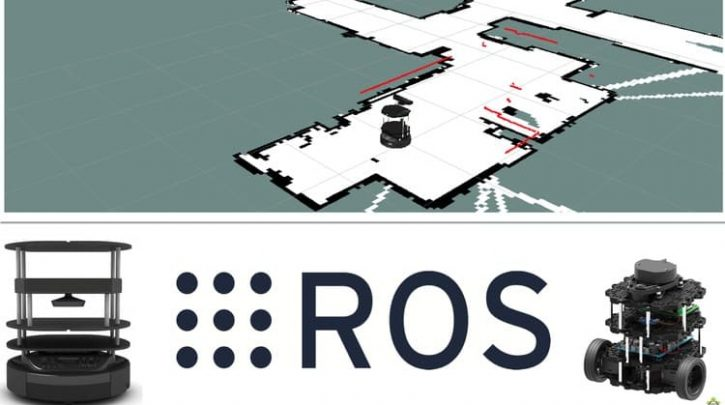
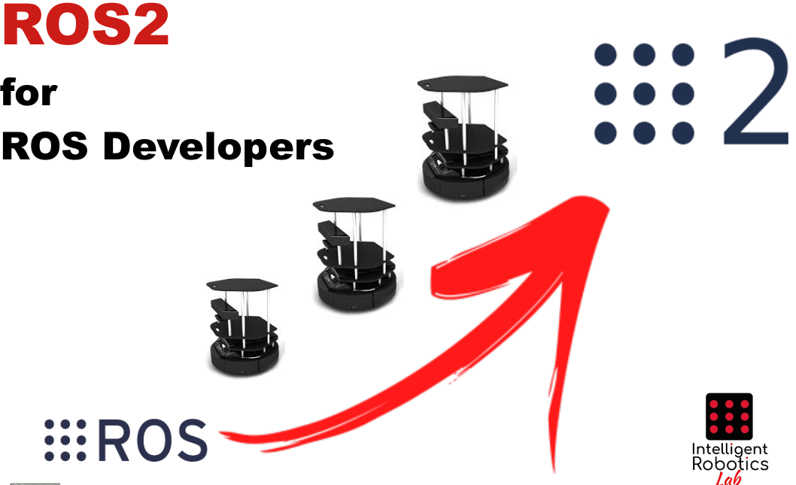

# ROS Course

Robot Operating System (ROS) Is the most used software around the world for robot programming. Since its beginnings, in 2006, its usage has been extended unstoppably. Nowadays, it is the standard in the robotic world.

  

# ROS2 Course

With the ROS2 release, a new system with much more advanced characteristics is raised and it will be the new standard in robotic software development in the industry.

  

# Navigation Course

The ROS/ROS2 navigation stack is one of its main packages and it allow to give a robot basic capacities of movement in an easy way.

  

# Perception Course

Sensors are a data source very important for robots. Because of them, they can recognize its environment and get information very valious about it.

  

# Deep Learning Course

Deep Learning is one of the most popular areas in the robotics field. Researchs in this area have got awesome results in fields like Natural Language Processing and Computer Vision.

  
