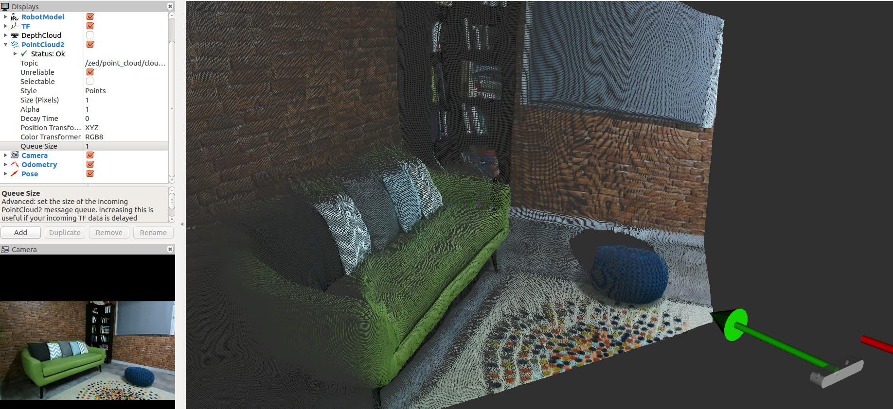

# ROS

Robot Operating System (ROS) Is the most used software around the world for robot programming. Since its beginnings, in 2006, its usage has been extended unstoppably. Nowadays, it is the standard in the robotic world.

  

# ROS2

Con el lanzamiento de ROS2, surge un nuevo sistema con unas características mucho más avanzadas y que será el nuevo estándar en desarrollo de software robótico en la industria

  

# Navegacion

El stack de navegación de ROS/ROS2 es uno de sus paquetes fundamentales y permite dotar a un robot de las capacidades básicas de movimiento de una forma sencilla

  

# Percepción

El stack de navegación de ROS/ROS2 es uno de sus paquetes fundamentales y permite dotar a un robot de las capacidades básicas de movimiento de una forma sencilla

  

# Deep Learning

El Deep Learning es una de las áreas de investigación más populares dentro del campo de la robótica. Las investigaciones en este área han logrado resultados sorprendes en campos como Procesamiento del Lenguaje Natural y Visión por computadora

  
