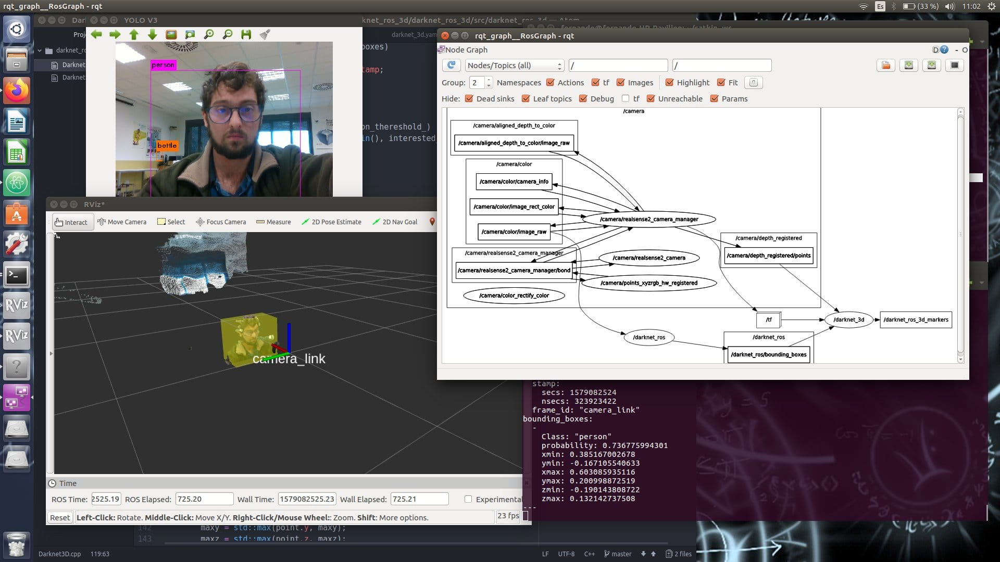

# ROS

Robot Operating System (ROS) es el software mas usado en el mundo para la programación de robots. Desde sus comienzos en 2006, su uso se ha extendido de forma imparable, siendo en la actualidad el estándar en el mundo de la robótica

  

# ROS2

Con el lanzamiento de ROS2, surge un nuevo sistema con unas características mucho más avanzadas y que será el nuevo estándar en desarrollo de software robótico en la industria

  

# Navegacion

El stack de navegación de ROS/ROS2 es uno de sus paquetes fundamentales y permite dotar a un robot de las capacidades básicas de movimiento de una forma sencilla

  

# Percepción

El stack de navegación de ROS/ROS2 es uno de sus paquetes fundamentales y permite dotar a un robot de las capacidades básicas de movimiento de una forma sencilla

  
